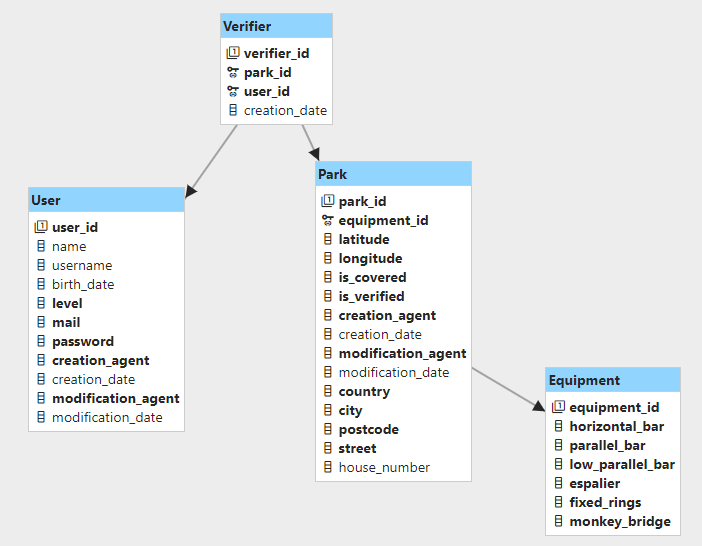

# API de localisation de parc de Street-workout

<!-- TOC -->

- [API de localisation de parc de Street-workout](#api-de-localisation-de-parc-de-street-workout)
    - [Concept](#concept)
    - [Détails de la base de données](#détails-de-la-base-de-données)
        - [Les tables](#les-tables)
        - [Diagramme de base de données](#diagramme-de-base-de-données)
    - [Endpoints](#endpoints)
        - [Liste des URL](#liste-des-url)

<!-- TOC -->

## Concept

API REST permettant d'accéder à une base de données de coordonnées de parcs de Street-workout. Pour chacun des parcs
référencés, une liste d'informations utile est associée (équipements, parc couvert, nombre d'utilisateurs ayant vérifié
le
parc ect...).

## Détails de la base de données

### Les tables

**Légende** :

- \* : Clé primaire
- \*\* : Clé étrangère

<table>
    <thead>
        <tr>
            <th colspan="3">Equipment</th>
        </tr>
        <tr>
            <th>Nom</th>
            <th>Type</th>
            <th>Description</th>
        </tr>
    </thead>
    <tbody>
        <tr>
            <td>equipment_id *</td>
            <td>BIGINT</td>
            <td>Identifiant de la table</td>
        </tr>
        <tr>
            <td>horizontal_bar</td>
            <td>INT</td>
            <td>Nombre de barres fixes</td>
        </tr>
        <tr>
            <td>parallel_bar</td>
            <td>INT</td>
            <td>Nombre de barres parallèles</td>
        </tr>
        <tr>
            <td>low_parallel_bar</td>
            <td>INT</td>
            <td>Nombre de barres parallèles basses</td>
        </tr>
        <tr>
            <td>espalier</td>
            <td>INT</td>
            <td>Nombre d'espaliers</td>
        </tr>
        <tr>
            <td>fixed_rings</td>
            <td>INT</td>
            <td>Nombre d'anneaux fixes</td>
        </tr>
        <tr>
            <td>monkey_bridge</td>
            <td>INT</td>
            <td>Nombre de ponts de singe</td>
        </tr>
    </tbody>
</table>

La table **Equipement** sert à référencer les différents équipements pouvant être présent dans un parc. Ils sont de type
INT pour que l'on puisse définir le nombre d'équipements (0 : l'équipement n'est pas présent, 1 : l'équipement est
présent 2 fois, etc...). Pour cette table, nous avons décidé de ne pas mettre les attributs _user, date, creation,
modification_, car elle est directement liée à la table **Park**. On peut donc retrouver ces informations en se référant
à la colonne de la table **Park** qui a pour _equipment_id_ l'id recherché.

<table>
    <thead>
        <tr>
            <th colspan="3">Park</th>
        </tr>
        <tr>
            <th>Nom</th>
            <th>Type</th>
            <th>Description</th>
        </tr>
    </thead>
    <tbody>
        <tr>
            <td>park_id *</td>
            <td>BIGINT</td>
            <td>Identifiant de la table</td>
        </tr>
        <tr>
            <td>equipment_id **</td>
            <td>BIGINT</td>
            <td>Identifiant des équipements disponibles dans le parc</td>
        </tr>
        <tr>
            <td>latitude</td>
            <td>DOUBLE</td>
            <td>Coordonnée correspondant à la latitude du parc</td>
        </tr>
        <tr>
            <td>longitude</td>
            <td>DOUBLE</td>
            <td>Coordonnée correspondant à la longitude du parc</td>
        </tr>
        <tr>
            <td>country</td>
            <td>STRING</td>
            <td>Pays de localisation du parc</td>
        </tr>
        <tr>
        <tr>
            <td>city</td>
            <td>STRING</td>
            <td>Ville de localisation du parc</td>
        </tr>
        <tr>
            <td>postcode</td>
            <td>STRING</td>
            <td>Code postal de localisation du parc</td>
        </tr>
        <tr>
            <td>street</td>
            <td>STRING</td>
            <td>Rue de localisation du parc</td>
        </tr>
        <tr>
            <td>house_number</td>
            <td>STRING</td>
            <td>Numéro de rue de localisation du parc</td>
        </tr>
        <tr>
            <td>is_covered</td>
            <td>TINYINT</td>
            <td>1 (true) si le parc est couvert, 0 (false) sinon</td>
        </tr>
        <tr>
            <td>verifierNumber</td>
            <td>INT</td>
            <td>Nombre d'utilisateur ayant vérifié le Park</td>
        </tr>
        <tr>
            <td>creation_agent</td>
            <td>VARCHAR(50)</td>
            <td>Identifiant de l’utilisateur ayant ajouté ce parc</td>
        </tr>
        <tr>
            <td>creation_date</td>
            <td>TIMESTAMP</td>
            <td>Date d’ajout du parc</td>
        </tr>
        <tr>
            <td>modification_agent</td>
            <td>VARCHAR(50)</td>
            <td>Identifiant du dernier utilisateur ayant modifié ce parc</td>
        </tr>
        <tr>
            <td>modification_date</td>
            <td>TIMESTAMP</td>
            <td>Date de la dernière modification du parc</td>
        </tr>
    </tbody>
</table>

La table **Park** va nous permettre de stocker toutes les informations relatives à un parc, sauf celles liées aux
équipements. Elle contient donc ses coordonnées, les détails de son adresse, si le parc est couvert (possibilité de
s'entraîner sous la pluie) et s'il est vérifié (validé par au moins 5 utilisateurs).

<table>
    <thead>
        <tr>
            <th colspan="3">User</th>
        </tr>
        <tr>
            <th>Nom</th>
            <th>Type</th>
            <th>Description</th>
        </tr>
    </thead>
    <tbody>
        <tr>
            <td>user_id *</td>
            <td>BIGINT</td>
            <td>Identifiant de la table</td>
        </tr>
        <tr>
            <td>name</td>
            <td>VARCHAR(100)</td>
            <td>Nom de l'utilisateur</td>
        </tr>
        <tr>
            <td>username</td>
            <td>VARCHAR(50)</td>
            <td>Pseudonyme de l'utilisateur</td>
        </tr>
        <tr>
            <td>birth_date</td>
            <td>DATE</td>
            <td>Date de naissance de l'utilisateur</td>
        </tr>
        <tr>
            <td>level</td>
            <td>ENUM('BEGINNER', 'INTERMEDIATE', 'EXPERT')</td>
            <td>Niveau de l'utilisateur, initialisé à 'BEGINNER'</td>
        </tr>
        <tr>
            <td>mail</td>
            <td>VARCHAR(100)</td>
            <td>Adresse mail de l'utilisateur</td>
        </tr>
        <tr>
            <td>password</td>
            <td>MEDIUMTEXT (à définir quand on connaîtra la taille du hash)</td>
            <td>Mot de passe chiffré de l'utilisateur</td>
        </tr>
        <tr>
            <td>creation_agent</td>
            <td>VARCHAR(50)</td>
            <td>Identifiant de l’utilisateur ayant ajouté cet utilisateur</td>
        </tr>
        <tr>
            <td>creation_date</td>
            <td>TIMESTAMP</td>
            <td>Date d’ajout de l'utilisateur</td>
        </tr>
        <tr>
            <td>modification_agent</td>
            <td>VARCHAR(50)</td>
            <td>Identifiant du dernier utilisateur ayant modifié cet utilisateur</td>
        </tr>
        <tr>
            <td>modification_date</td>
            <td>TIMESTAMP</td>
            <td>Date de la dernière modification de l'utilisateur</td>
        </tr>
    </tbody>
</table>

La table **User** va nous permettre de stocker toutes les informations relatives à un utilisateur. Elle va également
nous permettre de faire le lien avec l'attribut _verifierNumber_ de la table **park** via la table **Verifier**.

<table>
    <thead>
        <tr>
            <th colspan="3">Verifier</th>
        </tr>
        <tr>
            <th>Nom</th>
            <th>Type</th>
            <th>Description</th>
        </tr>
    </thead>
    <tbody>
        <tr>
            <td>verifier_id *</td>
            <td>BIGINT</td>
            <td>Identifiant de la table</td>
        </tr>
        <tr>
            <td>park_id **</td>
            <td>BIGINT</td>
            <td>Identifiant du parc étant vérifié</td>
        </tr>
        <tr>
            <td>user_id **</td>
            <td>BIGINT</td>
            <td>Identifiant de l'utilisateur ayant vérifié le parc</td>
        </tr>
        <tr>
            <td>creation_date</td>
            <td>TIMESTAMP</td>
            <td>Date d’ajout du vérificateur</td>
        </tr>
    </tbody>
</table>

La table **Verifier** va nous permettre de lier les utilisateurs à un parc. Elle recensera tous les utilisateurs ayant
vérifié un parc. Pour cette table, nous avons décidé de ne pas mettre d'attribut _creation_user_ car nous pouvons le
retrouver à l'aide de son attribut _user_id_. De plus, les attributs _modification_user_ et _modification_date_ sont
inutiles. En effet, un **Verifier** peut être soit ajouté, soit supprimé, mais pas modifié.

### Diagramme de base de données

## Endpoints

Notre API ne va contenir que 2 URI :

- Un premier qui sera lié à la gestion d'utilisateur : **/auth**
- Une seconde qui nous permettra d'administrer les parcs : **/park**

### Liste des URL

Gestion d'un **utilisateur** :

| URI            | HTTP verbe | Paramètres |     Body     | Description                             |
|----------------|------------|:----------:|:------------:|-----------------------------------------|
| /auths/:id     | GET        |     X      |      X       | Retourne un utilisateur                 |
| /auths/sign-up | POST       |     X      | User en JSON | Créé un utilisateur                     |
| /auths/login   | POST       |     X      | User en JSON | Se connecte avec un utilisateur         |
| /auths/:id     | PUT        |     X      |      X       | Met à jour les données d'un utilisateur |
| /auths/:id     | DELETE     |     X      |      X       | Supprime un utilisateur                 |

Gestion d'un **parc** :

| URI                    | HTTP verbe |                    Paramètres                     |       Body       | Description                                                                                    |
|------------------------|------------|:-------------------------------------------------:|:----------------:|------------------------------------------------------------------------------------------------|
| /parks                 | GET        |                         X                         |        X         | Retourne la liste de tous les parcs                                                            |
| /parks/filter-location | GET        | Float latitude, Float longitude, Integer distance |        X         | Retourne tous les parcs situés à _distance_ de la coordonné \[_latitude_, _longitude_]         |
| /parks/:id             | GET        |                         X                         |        X         | Retourne un parc                                                                               |
| /parks                 | POST       |                         X                         |   Park en JSON   | Créé un nouveau parc                                                                           |
| /parks/:id             | PUT        |                         X                         |        X         | Met à jour les données d'un parc                                                               |
| /parks/verifier        | PUT        |                         X                         | Verifier en JSON | Met à jour la donnée _verifierNumber_ d'un parc et créé une ligne dans la table **Verifier**   |
| /parks/:id             | DELETE     |                         X                         |        X         | Supprime un parc                                                                               |
| /parks/verifier        | DELETE     |                         X                         | Verifier en JSON | Met à jour la donnée verifierNumber d'un parc et supprime une ligne dans la table **Verifier** |
